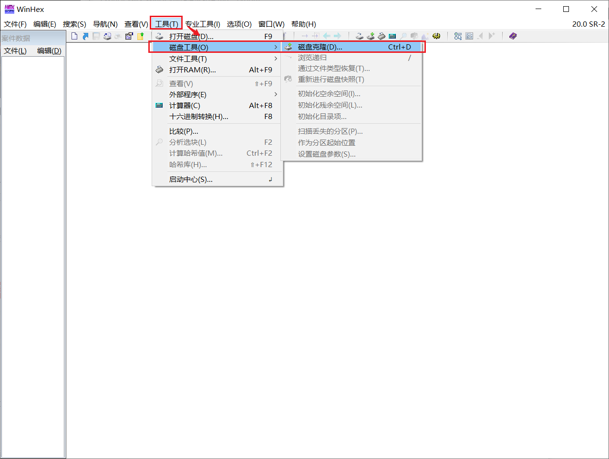
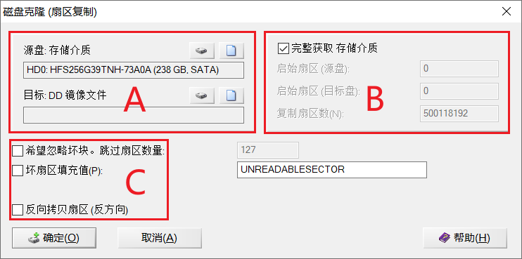
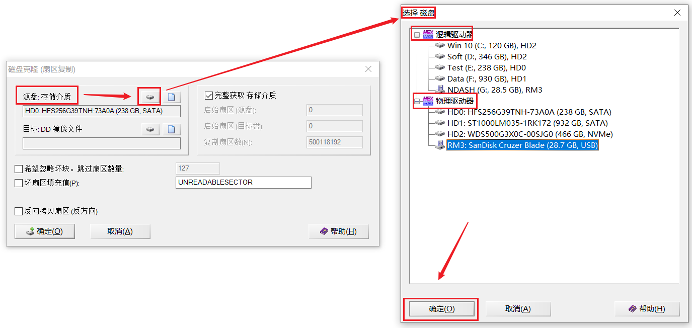
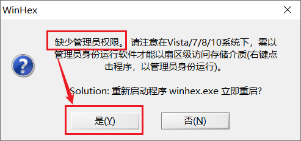
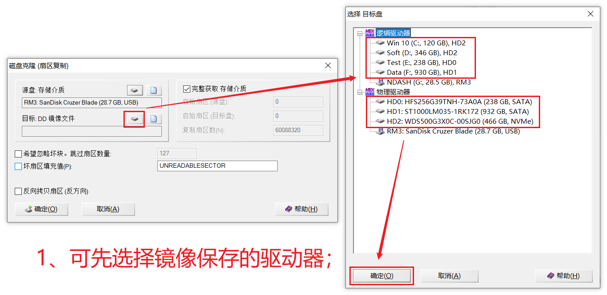
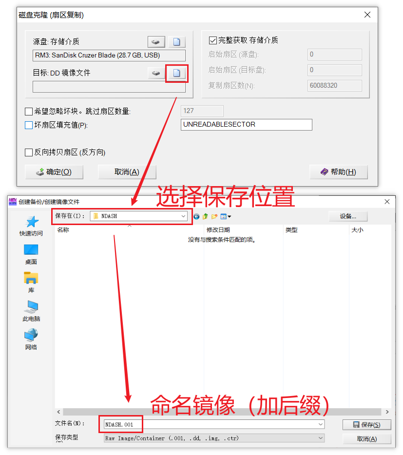
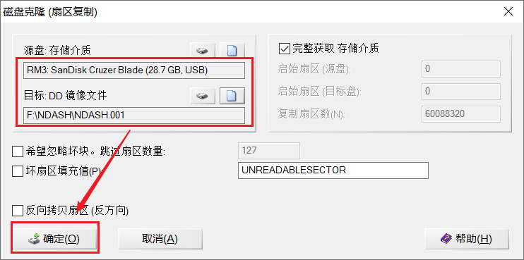
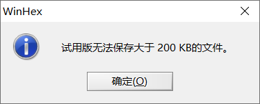

## 【WinHex篇】WinHex磁盘克隆教程

​		WinHex克隆功能---【蘇小沐】

[TOC]

# 一、磁盘克隆（扇区复制）

**路径：工具（T）->磁盘工具（O）->磁盘克隆（D）；**

 

主要分三块区域。

## （一）源盘：选择镜像磁盘

上半部分-**逻辑分区**；下半部分-**物理磁盘**。

在源盘区域选择需要做克隆的“磁盘或分区”，支持盘对盘，磁盘对镜像文件、镜像文件对磁盘的多种复制方式；支持完整复制和区域复制。

*****非管理员权限运行时，会提示缺少**管理员权限**，点击是，软件会重启以管理员权限来运行。

## （二）目标盘：选择保存路径

选择除了源盘（需要做克隆的盘），来存储镜像文件，且存储盘容量要大于源盘容量。

### 1、先选择保存的驱动器

### 2、直接选择保存的文件夹路径、并命名镜像（需要加后缀）

可以直接这步选择保存路径，注意别保存位置错误就行。

## （三）开始制作镜像

上面完成后，就可以点击确定开始制作镜像了（如果磁盘有坏区，可勾选下面的选项，跳过或填充坏扇区）。

**C区**支持坏扇区跳过并填充替代数据的功能；支持后台记录日志功能；支持复制性能优化功能。

*如果WinHex是**试用版本**，则无法保存大于**200KB**的文件。

## 总结

选的是整个磁盘镜像，如果只想要特定的扇区，可以在**B区**域自定义选择。

 

| 名称           | 时间                |
| -------------- | ------------------- |
| 开始编辑日期： | 2020 年 11 月 30 日 |
| 最后编辑日期： | 2020 年 11 月 30 日 |
